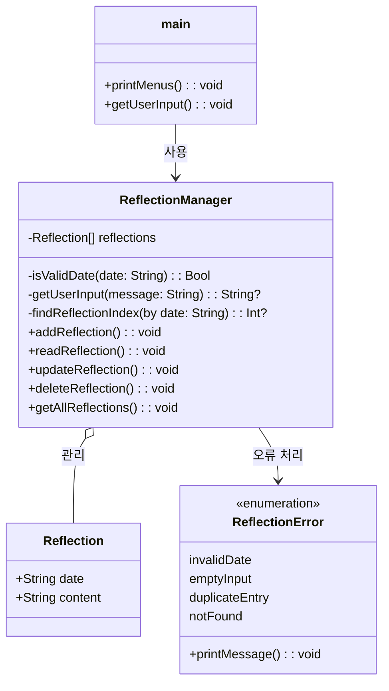

# 과제

Created Time: February 12, 2025 9:51 AM

# 과제 제목

> `class` , `struct` , `functions` , `enum` , `추상화`
> 

# **✅ 체크리스트**

- [x]  리팩토링할 요소 정하기
- [x]  프로그램 구조 설계하기
- [x]  리팩토링하기
- [x]  결과물 점검하기

---

# **🗒️ 학습 메모**

---

# **🏃‍♂️문제 해결 과정**

## 🔎 기능 요구사항 분석

| 기능 | 설명 | 입력 예시 | 출력 예시 |
| --- | --- | --- | --- |
| **1. 회고 추가** | 특정 날짜에 대한 회고 내용을 추가합니다. | 날짜: `2024-12-25`
내용: `오늘은 Swift를 공부했다.` | `회고가 추가되었습니다.` |
| **2. 회고 조회** | 특정 날짜의 회고 내용을 검색하여 출력합니다. | 날짜: `2024-12-25` | `날짜: 2024-12-25` `내용: 오늘은 Swift를 공부했다.` |
| **3. 회고 수정** | 기존에 저장된 회고 내용을 새로운 내용으로 수정합니다. | 날짜: `2024-12-25`
새로운 내용: `Swift 프로젝트를 완료했다.` | `회고가 수정되었습니다.` |
| **4. 회고 삭제** | 특정 날짜의 회고 데이터를 삭제합니다. | 날짜: `2024-12-25` | `회고가 삭제되었습니다.` |
| **5. 전체 회고 목록** | 저장된 모든 회고 내용을 날짜별로 출력합니다. | - | 날짜별 회고 목록 출력 |
| **6. 프로그램 종료** | 프로그램을 종료합니다. | - | `프로그램을 종료합니다.` |

## ✏️ 프로그래밍 요구사항 분석

- 예외 처리
    - 메뉴 선택 예외
    - 날짜 형식 예외
    - 빈 입력 값 예외
    - 동일한 날짜 회고 등록 시도 예외
    - 등록되지 않는 날짜 조회 시도 예외

### 메뉴 흐름도

```
1. 회고 추가
   └─ 날짜 입력 → 회고 내용 입력 → 딕셔너리에 저장 → 성공 메시지 출력

2. 회고 조회
   └─ 날짜 입력 → 딕셔너리에서 검색 → 결과 출력
      └─ 회고 있음: 회고 내용 출력
      └─ 회고 없음: "해당 날짜의 회고가 없습니다." 메시지 출력

3. 회고 수정
   └─ 날짜 입력 → 딕셔너리에서 검색
      └─ 회고 있음: 새로운 내용 입력 → 수정 → 성공 메시지 출력
      └─ 회고 없음: "해당 날짜의 회고가 없습니다." 메시지 출력

4. 회고 삭제
   └─ 날짜 입력 → 딕셔너리에서 검색
      └─ 회고 있음: 삭제 → 성공 메시지 출력
      └─ 회고 없음: "해당 날짜의 회고가 없습니다." 메시지 출력

5. 전체 회고 목록 출력
   └─ 딕셔너리에 저장된 모든 회고 출력
      └─ 회고 있음: 날짜별 회고 내용 출력
      └─ 회고 없음: "저장된 회고가 없습니다." 메시지 출력

6. 종료
   └─ 프로그램 종료 메시지 출력
```

- Q. 프로토콜을 사용할 이유가 있을까?
    
    지금은 회고를 관리하는 회고 시스템을 구현하는 것이지만, 추후 Object를 관리하는 시스템을 개발하는 걸 반복하게 된다면 protocol을 통해서 기본 CRUD 기능을 갖는 프로토콜을 구현해두고 이를 채택하여 사용하면 좋을 것 같다.
    
    하지만, 이번주 과제에는 적용하지 않고, class, struct, func을 활용해서 개발해보았다.
    

## **🎨 프로그램** 설계



## **👩‍💻** 트러블 슈팅

### Swift에서의 배열 순서 관리

- Arrays에 접근할 때마다 순서가 달라짐 → sorted를 통해 정렬하여 출력하는 방식 도입

```swift
for reflection in reflections.sorted(by: { $0.date < $1.date }) {
		print("날짜: \(reflection.date)\n내용: \(reflection.content)\n")
}
```

---

# **🖨️ 동작 예시 및 출력 결과**

[코드 바로보기](https://github.com/doyeonk429/iOSLecture/tree/main/Lecture/weekly02/weekly02)

## Code

### main.swift

```swift
import Foundation

/// 메뉴 출력 함수
func printMenus() {
    print("""
    === 회고 시스템 ===
    1. 회고 추가
    2. 회고 조회
    3. 회고 수정
    4. 회고 삭제
    5. 전체 회고 목록 출력
    6. 종료
    """)
}

/// 사용자 입력 처리 함수
func getUserInput() {
    let manager = ReflectionManager()
    printMenus()

    while true {
        print("메뉴를 입력하세요:", terminator: " ")
        guard let input = Int(readLine() ?? ""), (1...6).contains(input) else {
            print("잘못된 메뉴 선택입니다.")
            continue
        }

        switch input {
        case 1: manager.addReflection()
        case 2: manager.readReflection()
        case 3: manager.updateReflection()
        case 4: manager.deleteReflection()
        case 5: manager.getAllReflections()
        case 6:
            print("프로그램을 종료합니다.")
            return
        default:
            print("잘못된 메뉴 선택입니다.")
        }
    }
}

getUserInput()

```

### ReflectionDataModel.swift

```swift
import Foundation

/// 회고 데이터 모델
struct Reflection {
    let date: String  // yyyy-MM-dd 형식
    var content: String
}
```

### ReflectionError.swift

```swift
import Foundation

/// 회고 관련 에러 메시지를 관리하는 열거형
enum ReflectionError: String {
    case invalidDate = "잘못된 날짜 형식입니다. (예: 2025-02-07)"
    case emptyInput = "입력된 값이 없습니다."
    case duplicateEntry = "해당 날짜의 회고가 이미 존재합니다. 수정 기능을 이용하세요."
    case notFound = "해당 날짜의 회고가 없습니다."

    /// 에러 메시지를 출력하는 함수
    func printMessage() {
        print(self.rawValue)
    }
}
```

### ReflectionManager.swift

```swift
import Foundation

/// 회고 관리를 위한 클래스
class ReflectionManager {
    /// 저장된 회고 목록을 관리하는 배열
    private var reflections: [Reflection] = []
    
    //MARK: - Internal Funcs

    /// 입력된 날짜 문자열이 `yyyy-MM-dd` 형식인지 검증하는 함수
    ///
    /// - Parameter date: 사용자가 입력한 날짜 문자열
    /// - Returns: 날짜 형식이 올바르면 `true`, 그렇지 않으면 `false`
    private func isValidDate(_ date: String) -> Bool {
        let dateFormatter = DateFormatter()
        dateFormatter.dateFormat = "yyyy-MM-dd"
        dateFormatter.locale = Locale(identifier: "ko_KR")
        return dateFormatter.date(from: date) != nil
    }
    
    /// 사용자 입력을 받는 함수 (공통 기능)
    ///
    /// - Parameter message: 입력 메시지
    /// - Returns: 입력받은 문자열 (공백일 경우 `nil`)
    private func getUserInput(_ message: String) -> String? {
        print("\(message)", terminator: " ")
        let input = readLine()?.trimmingCharacters(in: .whitespacesAndNewlines)
        return input?.isEmpty == true ? nil : input
    }

    
    /// 특정 날짜의 회고 인덱스를 찾는 함수
    ///
    /// - Parameter date: 검색할 날짜
    /// - Returns: 배열 내 인덱스 (없으면 `nil`)
    private func findReflectionIndex(by date: String) -> Int? {
        return reflections.firstIndex(where: { $0.date == date })
    }
    
    //MARK: - Public Funcs
    /// 새로운 회고를 추가하는 함수
    func addReflection() {
        guard let date = getUserInput("날짜를 입력하세요 (예: 2025-02-07):"), isValidDate(date) else {
            ReflectionError.invalidDate.printMessage()
            return
        }

        if findReflectionIndex(by: date) != nil {
            ReflectionError.duplicateEntry.printMessage()
            return
        }

        guard let content = getUserInput("회고 내용을 입력하세요:") else {
            ReflectionError.emptyInput.printMessage()
            return
        }

        reflections.append(Reflection(date: date, content: content))
        print("회고가 추가되었습니다.")
    }

    /// 특정 날짜의 회고를 조회하는 함수
    func readReflection() {
        guard let date = getUserInput("조회할 날짜를 입력하세요:"),
              let reflection = reflections.first(where: { $0.date == date }) else {
            ReflectionError.notFound.printMessage()
            return
        }

        print("날짜: \(reflection.date)\n내용: \(reflection.content)")
    }

    /// 기존 회고를 수정하는 함수
    func updateReflection() {
        guard let date = getUserInput("수정할 날짜를 입력하세요:"),
              let index = findReflectionIndex(by: date) else {
            ReflectionError.notFound.printMessage()
            return
        }

        guard let newContent = getUserInput("새로운 회고 내용을 입력하세요:") else {
            ReflectionError.emptyInput.printMessage()
            return
        }

        reflections[index].content = newContent
        print("회고가 수정되었습니다.")
    }

    /// 특정 날짜의 회고를 삭제하는 함수
    func deleteReflection() {
        guard let date = getUserInput("삭제할 날짜를 입력하세요:"),
              let index = findReflectionIndex(by: date) else {
            ReflectionError.notFound.printMessage()
            return
        }

        reflections.remove(at: index)
        print("회고가 삭제되었습니다.")
    }

    /// 저장된 모든 회고를 출력하는 함수
    func getAllReflections() {
        if reflections.isEmpty {
            print("저장된 회고가 없습니다.")
            return
        }

        print("=== 저장된 회고 목록 ===")
        for reflection in reflections.sorted(by: { $0.date < $1.date }) {
            print("날짜: \(reflection.date)\n내용: \(reflection.content)\n")
        }
    }
}

```

## 출력 결과

<br/>


